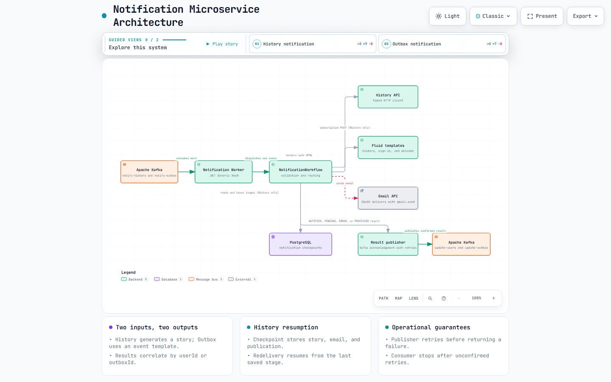

# VaultHistory.Microservice.Notification

`VaultHistory.Microservice.Notification` is the background worker that turns Vault History events into email notifications. It is a .NET 10 Generic Host: it has no HTTP endpoints, Swagger surface, or listening port.

The worker consumes Kafka work, generates subscription stories when required, renders safe Fluid/Liquid email HTML, delivers through Gmail, and publishes correlated outcomes for User and Jobs.

## Architecture



*The architecture shows the two Kafka inputs, the History and Outbox paths, checkpoint persistence, Gmail delivery, and the two correlated Kafka outputs.*

- [Open the interactive architecture](docs/architecture/notification-architecture.html)
- [Edit the architecture source](docs/architecture/notification-architecture.json)
- [Read focused implementation notes](docs/architecture.md)

### Responsibilities and flow

- `notify-history-topic` starts a subscription-history notification. The worker validates the message, reads its PostgreSQL checkpoint, calls the History API when a story has not already been saved, renders the history template, sends the email, and publishes a user result.
- `notify-outbox-topic` carries user outbox events. Jobs currently routes both `UserSignedInEvent` and `CreateUserEvent`; the worker selects the sign-in or welcome template, sends the email, and publishes an outbox result. Other event types are rejected as unsupported.
- `update-users-topic` receives user notification results and `update-outbox-topic` receives outbox statuses. Messages use camel-case JSON with the envelope `{ "id": "...", "data": { ... } }`; the Kafka key is the same user or outbox identifier.

### Delivery guarantees and recovery

History notifications keep a PostgreSQL checkpoint keyed by `notificationId` (or `userId` when it is absent). The checkpoint stores the generated story, confirmed Gmail submission, and confirmed Kafka publication. A Kafka redelivery resumes at the last saved stage.

This is an at-least-once flow, not exactly-once email delivery: if the process stops after Gmail accepts the message but before the checkpoint is saved, a redelivery can send the email again. Safe-to-retry History and template failures publish `PENDING`; other History failures and all Outbox failures publish `ERROR`. Kafka result publishing and consumer handling use bounded retries. When consumer retries are exhausted, the worker stops before an unconfirmed notification can be acknowledged.

## Technology and project structure

- .NET 10 worker with dependency boundaries: `Domain` has no provider dependency; `Application` depends on `Domain`; `Infrastructure` implements provider ports; `Worker` composes the host.
- SlimMessageBus 3.5 with the Kafka provider for JSON messaging and consumer checkpoints.
- Typed `HttpClient` for History, Fluid for templates, Gmail API OAuth for delivery, and Npgsql/PostgreSQL for notification checkpoints.

```text
src/
  VaultHistory.Notification.Domain/          Results and notification domain types
  VaultHistory.Notification.Application/     Workflow, contracts, and ports
  VaultHistory.Notification.Infrastructure/  Kafka, History, Gmail, templates, checkpoints
  VaultHistory.Notification.Worker/          Host startup, configuration, and Liquid templates
tests/                                       Unit and infrastructure integration tests
docs/                                        Architecture assets and focused OAuth guidance
```

## Prerequisites and configuration

Install the .NET SDK declared in [`global.json`](global.json). The Worker validates required settings when it starts. Keep values out of `appsettings.json`; supply them as .NET user secrets or environment variables.

| Area | Required settings |
| --- | --- |
| PostgreSQL checkpoints | `ConnectionStrings__DefaultConnection` |
| Kafka | `Kafka__BootstrapServers`, plus the configured group, topics, processing timeout, and retry settings |
| History | `History__BaseUrl`, `History__AuthorizationToken`, and optional `History__SubscriptionPath` / `History__TimeoutSeconds` |
| Gmail | `Gmail__SenderAddress`, `Gmail__SenderName`, `Gmail__ClientId`, `Gmail__ClientSecret`, and `Gmail__RefreshToken` |
| Templates | `Templates__HistoryTemplatePath`, `Templates__SignInTemplatePath`, `Templates__WelcomeTemplatePath`, and `Templates__TimeZoneId` |

The default configuration declares the four Kafka topics, uses the `vault-history-notification` consumer group, and formats sign-in timestamps in `America/Guayaquil`. See [Gmail OAuth configuration](docs/gmail-oauth.md) for the one-time refresh-token setup and its `gmail.send` scope.

## Messaging contracts

`NotifyHistoryMessage` contains `userId`, `email`, `fullname`, optional `birthDate`, `theme`, `character`, and optional `notificationId`. The typed History client calls `POST api/v1/history/generate/subscription` with the configured authorization header and forwards `notificationId` as the request idempotency key when it is present. It does not retry the POST itself, because the downstream service persists generated stories.

`NotifyOutboxMessage` contains `outboxId`, `userId`, `email`, `fullname`, optional `birthDate`, `type`, and optional `occurredOn`. `UserSignedInEvent` requires `occurredOn`; `CreateUserEvent` uses the welcome template. All rendered fields are HTML-encoded by Fluid before Gmail delivery.

Successful history delivery publishes `NOTIFIED` with a notification date. Successful outbox delivery publishes `PROCESSED`. Error results include a sanitized failure code and preserve the original user or outbox correlation ID.

## Run and test locally

```powershell
dotnet restore VaultHistory.Notification.slnx
dotnet build VaultHistory.Notification.slnx --no-restore
dotnet test VaultHistory.Notification.slnx --no-build
```

Template rendering, compilation, and tests that use fakes do not send real email or require Gmail credentials. A real Kafka broker, History API, PostgreSQL checkpoint database, and Gmail secrets are required to process live notifications.

The service image and the multi-service environment are orchestrated by [Vault.History.System](https://github.com/CarlosSV923/Vault.History.System). From that repository's checkout, use:

```powershell
docker compose up --build -d
docker compose ps
docker compose logs notification
```

Notification itself exposes no HTTP port.

## Releases and related documentation

Release Please runs for changes promoted to `main` and keeps `CHANGELOG.md`, `version.txt`, and the release tag aligned through Conventional Commits. It is not a CI validation pipeline.

- [Gmail OAuth configuration](docs/gmail-oauth.md)
- [Architecture implementation notes](docs/architecture.md)
- [Vault.History.System orchestration repository](https://github.com/CarlosSV923/Vault.History.System)
- [Vault History project](https://github.com/users/CarlosSV923/projects/3)
